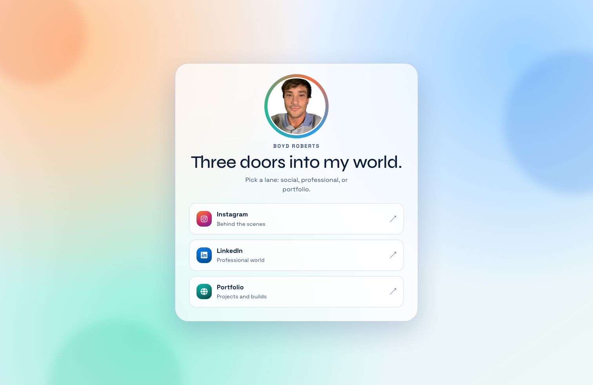

# LinkX

A hand-built personal link hub in React — a single-screen "constellation" that connects visitors to my work, writing, and socials.

**[Live site →](https://coleyrockin.github.io/linkx/)**



## Why this exists

Most link-in-bio pages are rented real estate on someone else's platform. LinkX is a small, deliberate alternative: mine to own, mine to style, and a playground for motion-design ideas I want to try.

## What it demonstrates

- **Canvas-based particle system** — ~80 softly-repelling particles with cursor interaction and neighbor-connection lines, all in a single `requestAnimationFrame` loop with proper cleanup.
- **Progressive enhancement** — degrades gracefully on coarse pointers (fewer particles, no mouse tracking) and respects `prefers-reduced-motion` (skips animation entirely).
- **CSS custom properties as an animation API** — pointer position and parallax tilt are written to `--pointer-x`, `--portrait-rotate-y`, etc., keeping JS → CSS handoff cheap and declarative.
- **Accessible by default** — semantic landmarks, labeled `nav`, `aria-hidden` on decorative layers, focus-visible states, alt text, safe outbound links (`rel="noopener noreferrer"`).
- **CI/CD** — pushes to `main` trigger a GitHub Actions workflow that builds and deploys to GitHub Pages.
- **Test coverage on the contract that matters** — a smoke test asserts every outbound link resolves to the right URL with the right security attributes.

## Tech stack

- **React 18** (Create React App)
- **Vanilla CSS** with custom-property-driven theming (no Tailwind, no CSS-in-JS)
- **Canvas 2D API** for the particle field
- **React Icons** for platform glyphs
- **Syne + Space Grotesk** typography pairing
- **GitHub Actions** → **GitHub Pages** for deploys

## Local development

```bash
npm install
npm start
```

## Tests

```bash
npm test -- --watchAll=false
```

## Deployment

Pushes to `main` run [`.github/workflows/deploy-pages.yml`](.github/workflows/deploy-pages.yml), which builds with `npm run build` and publishes the `build/` artifact to GitHub Pages. To wire it up on a fork: repo **Settings → Pages → Source: GitHub Actions**.

## What I'd build next

- **Outbound click analytics** — a lightweight serverless endpoint (Vercel Function) to count which links actually get used, without third-party trackers.
- **WebGL shader layer** — swap the 2D canvas for a fragment shader to push visual density without a CPU cost.
- **CMS-free content edits** — drive the link list from a small JSON file served via a GitHub Action on tag, so I can update without a redeploy loop.

## License

[MIT](LICENSE)
