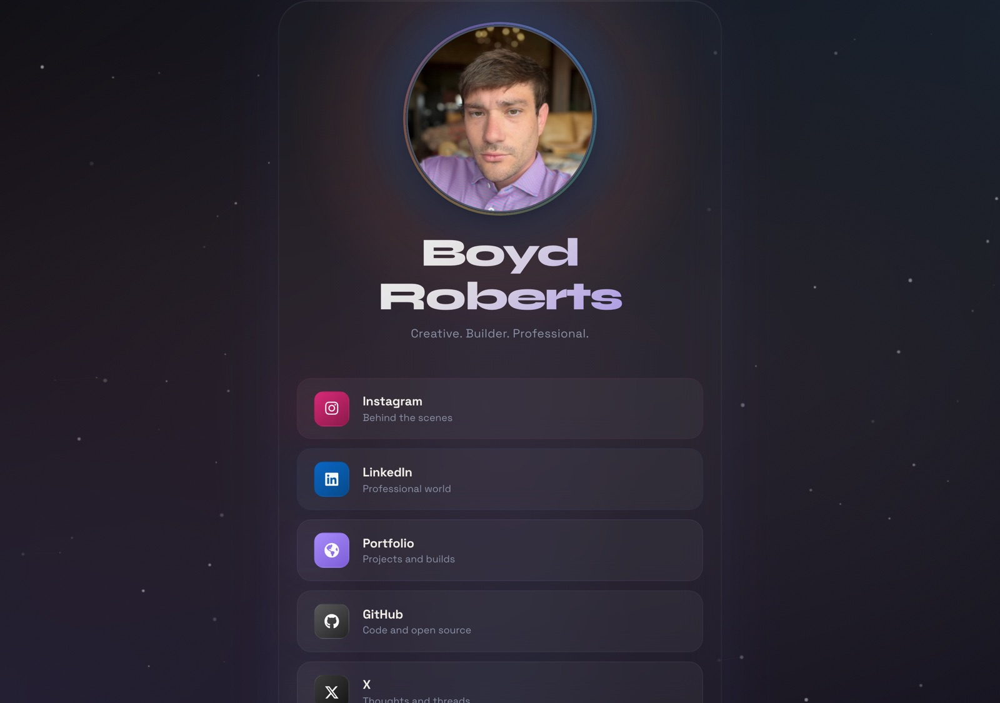

# LinkX

A hand-built personal link hub in React — a single-screen "constellation" that connects visitors to my work, writing, and socials.

[](https://github.com/coleyrockin/linkx/actions/workflows/deploy-pages.yml)
[](https://github.com/coleyrockin/linkx/actions/workflows/audit.yml)
[](LICENSE)

**[Live site →](https://coleyrockin.github.io/linkx/)**



## Why this exists

Most link-in-bio pages are rented real estate on someone else's platform. LinkX is a small, deliberate alternative: mine to own, mine to style, and a playground for motion-design ideas I want to try.

## What it demonstrates

- **Canvas-based particle system** — ~80 softly-repelling particles with cursor interaction and neighbor-connection lines, running in a single `requestAnimationFrame` loop. Extracted into a reusable [`useParticleField`](src/hooks/useParticleField.js) hook.
- **Progressive enhancement** — degrades gracefully on coarse pointers (fewer particles, no mouse tracking) and respects `prefers-reduced-motion` (skips animation entirely).
- **Light + dark themes** — the whole palette flips via `prefers-color-scheme`, no toggle required.
- **Privacy-friendly analytics** — outbound clicks are tracked through Plausible (no cookies, no PII) via a small [`trackOutbound`](src/lib/analytics.js) helper that falls back to `console.info` in dev.
- **CSS custom properties as an animation API** — pointer position and parallax tilt are written to `--pointer-x`, `--portrait-rotate-y`, etc., keeping the JS → CSS handoff cheap and declarative.
- **Accessible by default** — skip-link, semantic landmarks, labeled `nav`, `aria-hidden` on decorative layers, visible focus rings, alt text, arrow-key navigation across the link stack, and `rel="noopener noreferrer"` on outbound links. Enforced in CI by axe-core.
- **Data-driven content** — the link stack and the "Now" section are plain JSON ([`links.json`](src/data/links.json), [`now.json`](src/data/now.json)), decoupled from the presentation layer.
- **Real CI** — every push runs unit tests before deploy; a parallel audit workflow runs a Playwright end-to-end smoke test and an axe a11y audit on the built site. Unit tests gate deploys; the audit reports independently.

## Tech stack

- **React 18** on **Vite 6** (migrated off Create React App)
- **Vanilla CSS** with custom-property-driven theming (no Tailwind, no CSS-in-JS)
- **Canvas 2D API** for the particle field
- **Vitest** + **@testing-library/react** for unit tests
- **Playwright** + **@axe-core/playwright** for end-to-end and a11y tests
- **GitHub Actions** → **GitHub Pages** for deploys

## Keyboard shortcuts

- `Tab` — cycles through the skip-link, then the link stack.
- `↑` / `↓` — move focus between links while the stack is focused.
- `Enter` — opens the focused link in a new tab.

## Local development

```bash
npm install
npm run dev
```

## Tests

```bash
npm test            # Unit tests (Vitest)
npm run test:e2e    # End-to-end + a11y audit (Playwright + axe-core)
```

## Deployment

Pushes to `main` run [`.github/workflows/deploy-pages.yml`](.github/workflows/deploy-pages.yml): unit tests → Vite build → Pages artifact → deploy. The audit workflow ([`.github/workflows/audit.yml`](.github/workflows/audit.yml)) runs the full Playwright suite against the built site in parallel.

## What I'd build next

- **WebGL shader backdrop** — swap the 2D canvas for a fragment shader (flow-map noise) to push visual density without a CPU cost.
- **Per-link SSR landing pages** — migrate to Next.js with static export and a page per destination, each with tailored OG metadata. Better share previews for every link.
- **Theme-aware OG image** — generate a dynamic 1200×630 via an Edge Function that respects the requester's color scheme.

## License

[MIT](LICENSE)
