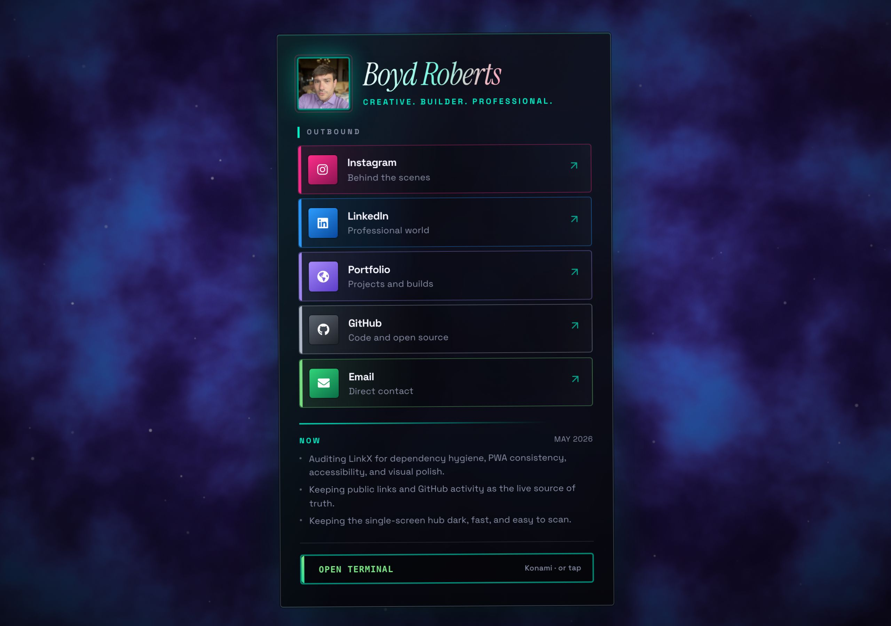

# LinkX

A single-screen personal hub in React for a small, high-signal professional presence.

[](https://github.com/coleyrockin/linkx/actions/workflows/deploy-pages.yml)
[](https://github.com/coleyrockin/linkx/actions/workflows/audit.yml)
[](LICENSE)

**Live site:** [https://coleyrockin.github.io/linkx/](https://coleyrockin.github.io/linkx/)



## What this project is

LinkX is a **portfolio-facing link hub** with:

- Curated outbound links
- A GitHub activity section (live feed with static fallback)
- Visual motion layers (WebGL shader + particle field + CSS effects)
- A hidden developer terminal with parser-backed commands
- Service worker registration for installability/offline behavior

The app intentionally stays single-screen and does not attempt to become a full CMS.

## Current scope (as of latest docs update)

- Production path: `https://coleyrockin.github.io/linkx/`
- Local development path: `http://localhost:5188/` (`strictPort: 5188`)
- Core runtime data sources: `src/data/links.json`, `src/data/links.js`, `src/data/now.json`
- GitHub activity fallback: `src/lib/github.js` (localStorage cache + API fallback behavior)

## What it demonstrates today

- React + Vite SPA composition
- Canvas/WebGL progressive enhancement for visual background
- Terminal command handling via shared command map
- Error boundary with fallback links and retry
- CI with build, lint, unit tests, and Playwright + axe coverage

## Tech stack

- React 18 + Vite 6
- Vanilla CSS
- Canvas 2D + WebGL 1
- Vitest + Testing Library
- Playwright + @axe-core/playwright
- ESLint 9 (flat config)
- GitHub Actions + GitHub Pages

## Project status

- `DONE`: Foundation, styling, rendering stack, terminal, Now feed, PWA registration, and test coverage.
- `DONE`: Accessibility-first basics (keyboard flow, semantic landmarks, terminal semantics, smoke + axe checks).
- `PLANNED`: The next agent roadmap is documented in [`ROADMAP.md`](ROADMAP.md).

## Setup

```bash
npm install
npm run dev
```

Then open [http://localhost:5188/](http://localhost:5188/).

## Run and verify

```bash
npm run lint            # ESLint
npm test                # Vitest
npm run build           # production build
npm run test:e2e        # Playwright + axe checks
npm audit --omit=dev    # dependency risk check
```

### Local scripts

```bash
npm run og              # regenerate public/og-image.jpg from scripts/og.svg
npm run screenshot      # capture the README/demo asset image
```

## Deployment

- Pushes to `main` trigger deployment workflow:
  - GitHub Pages artifact build and publish
  - Audit workflow runs Playwright + axe checks
- See: [deploy-pages.yml](.github/workflows/deploy-pages.yml), [audit.yml](.github/workflows/audit.yml)

## Keyboard shortcuts

- `Tab` — cycle focus, including skip link and core controls
- `Enter` — activate focused controls
- `↑ ↑ ↓ ↓ ← → ← → B A` — open hidden terminal
- `Esc` — close terminal

## Documentation

- [ROADMAP.md](ROADMAP.md): next-agent operating plan with priorities, acceptance criteria, and risk controls.
- [LICENSE](LICENSE)

## Known limitations

- The Now feed is a combination of live GitHub data and static fallback data in `src/data/now.json`.
- External links are intentionally opened in a new tab; `mailto:` stays same-tab behavior.
- Third-party fonts and analytics script are environment-dependent.

## Why this belongs in a portfolio

- It demonstrates visual execution with operational constraints (testing, CI, accessibility checks, and deployment hygiene).
- It balances polish with restraint and keeps the signal clear for hiring/portfolio review.
